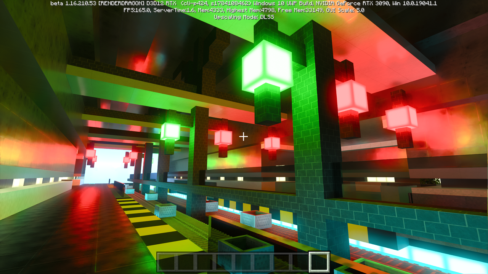
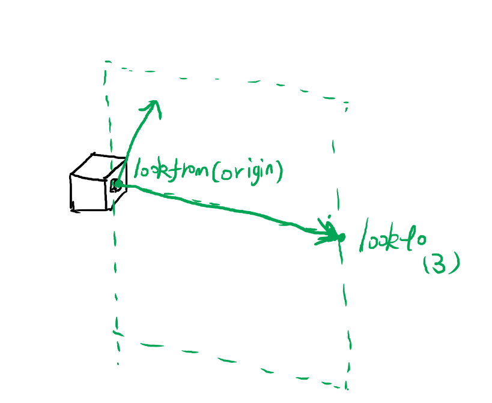

### 其他

#### 改进摄像机

我们之前实现的摄像机十分简陋, 其中视野范围是直接在空间中划定了一个矩形来描述的. 我们这里将这个描述改为更合理的两个参数: [FOV](https://en.wikipedia.org/wiki/Field_of_view) 和屏幕比例 `aspect`.

这是 Minecraft 在不同 FOV 下的视觉效果:

FOV: 60°



FOV: 110°


通过这两个参数我们可以计算出之前定义的参数:

```ts
constructor(origin: Vec3, vfov: number, aspect = 2) {
  const θ = (vfov * Math.PI) / 180;
  const harfHeight = Math.tan(θ / 2);
  const harfWidth = harfHeight * aspect;

  this.origin = origin;
  this.leftBottom = new Vec3(-harfWidth, -harfHeight, -1).add(origin);
  this.vertical = new Vec3(0, harfHeight * 2, 0);
  this.horizontal = new Vec3(harfWidth * 2, 0, 0);
}
```

修改一下摄像机的定义

```ts
const camera = new Camera(new Vec3(0, 0, 1), 60, 2);
```


下一步是相机的方向. 我们已经有了相机的位置, 因为三维空间的自由度是 6, 因此要完全确定相机的姿态, 还需要另外三个角度数值, 如下图所示


但是通过旋转角度来定义太不直观了, 写起来也难写. 我们用两外一种方式来确定姿态. 我们用两个向量, 一个是相机的朝向, 也是相机所在平面的法线向量, 这个向量确定了两个自由度, 另外再用一个向量来指定相机的 "上" 方向, 这个向量确定了最后一个自由度. 这两个向量共同确定了相机平面的一个垂直平面, 相机的姿态就可以确定下来了.



修改后的代码如下

```ts
  constructor(origin: Vec3, lookto: Vec3, vup: Vec3, vfov: number, aspect = 2) {
    const θ = (vfov * Math.PI) / 180;
    const harfHeight = Math.tan(θ / 2);
    const harfWidth = harfHeight * aspect;

    const front = lookto.sub(origin).unitVec();
    const right = Vec3.cross(front, vup).unitVec();
    const up = Vec3.cross(right, front).unitVec();

    this.origin = origin;

    this.vertical = up.mul(harfHeight * 2);
    this.horizontal = right.mul(harfWidth * 2);
    this.leftBottom = origin.sub(up.mul(harfHeight)).sub(right.mul(harfWidth)).add(front);
  }
```

```ts
const camera = new Camera(
  new Vec3(-2,2,1),
  new Vec3(0,0,-1),
  new Vec3(0,1,0),
  90,2
);
```


### 平面

下面放个大球当地面多少还是有点奇怪, 我们可以再做一个平面的形状放在下面. 平面可以由一个点和一条法线向量来确定.

```ts
export default class Plane implements Hitable {
  origin: Vec3;
  normal: Vec3;
  material: Material;

  constructor(origin: Vec3, normal: Vec3, material: Material) {
    this.origin = origin;
    this.normal = normal.unitVec();
    this.material = material;
  }

  hit(ray: Ray, t_min: number, t_max: number): HitResult {
    const nd = Vec3.dot(this.normal, ray.direction);
    if (nd === 0) {
      return null;
    }
    const t = -1 * Vec3.dot(this.normal, ray.origin.sub(this.origin)) / nd;

    if (t < t_min || t > t_max) {
      return null;
    }

    const p = ray.getPoint(t);
    const hit = new HitRecord(t, p, Vec3.dot(ray.direction, this.normal) < 0 ? this.normal : this.normal.mul(-1));
    const [rayOut, attenuation] = this.material.scatter(ray, hit);
    return [hit, rayOut, attenuation];
  }
}
```


### 景深与光圈

// TODO

### 最终效果图实现

//TODO

## 历史记录

|Version| Action|Time|
|:-------:|:--------:|:-----------:|
|1.0|Init|2021-03-18 15:39:22|
